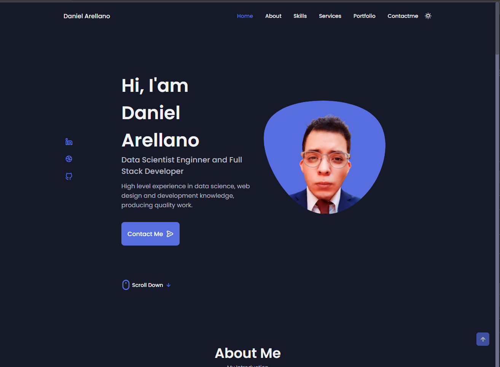
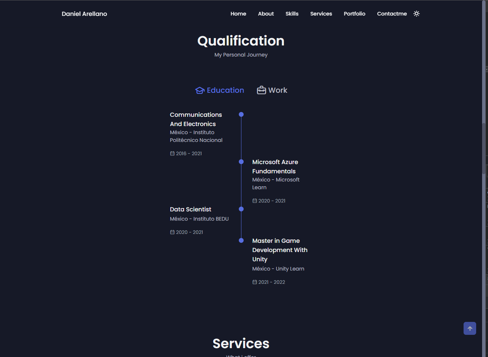
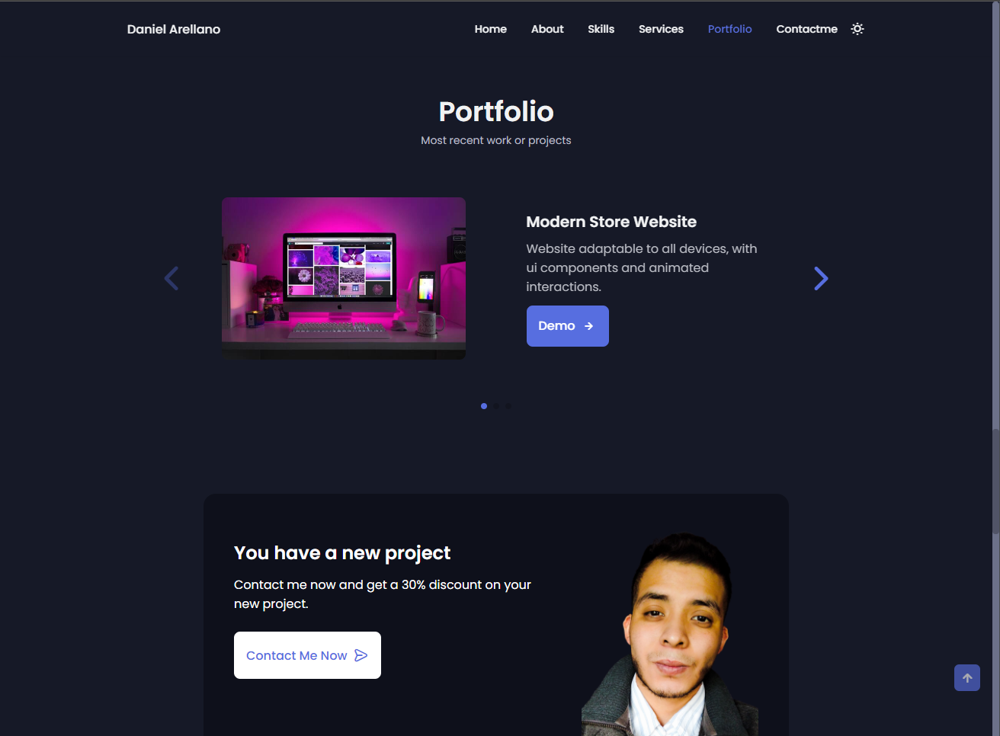
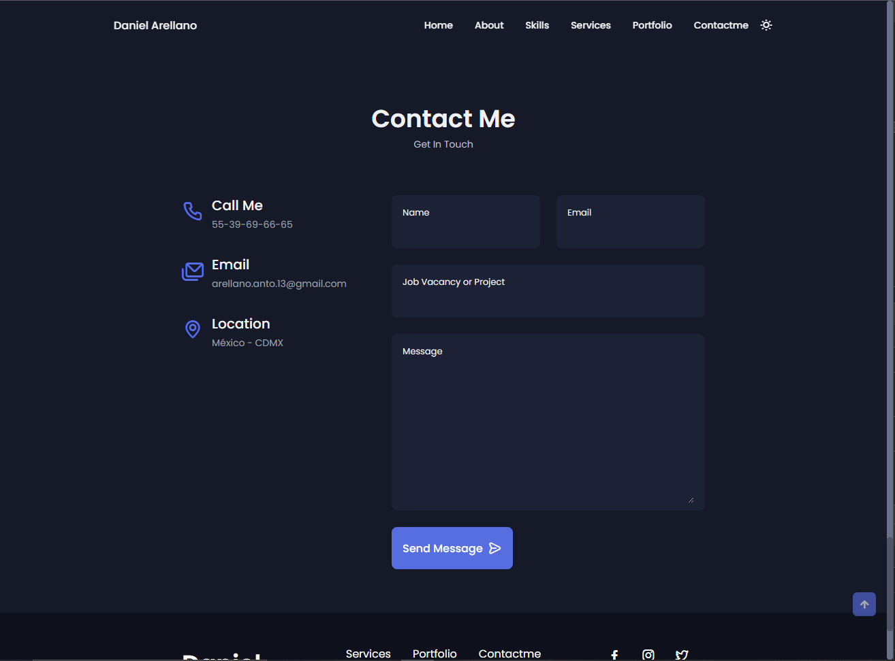

# Portfolio Personal 📋
Este es mi Portafolio personal, con mi información tanto académica, laboral y mis skills con todo detalle y de una forma mas interactiva y visual.

## website-responsvive 🚀

## Comenzando ⚙️

_Puedes descargar el repositorio y consultar el Código de las siguientes maneras:_

- Dando clic en **Code** en el repositorio y después **Download ZIP**..
- Haciendo un **Git clone** del repositorio directamente en tu computadora
- Ingresando al siguiente link para ver el preview [Portafolio Profesional](https://colab.research.google.com/drive/1lexfeyDqg7DZj2CV5-mo5bB8yu4agsZ8?usp=sharing)

### Preview del proyecto 📋

## Autor ✒️

- **Daniel Arellano** - \*\* - [Tachuelin](https://github.com/Tachuelin)